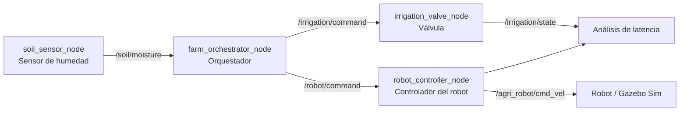

# Agri ROS 2 Workspace

Plataforma robótica agrícola basada en ROS 2 para probar la interoperabilidad entre sensores de humedad del suelo, control de riego, orquestación de decisiones y movimiento de un robot agrícola. El workspace incluye interfaces ROS 2 propias, nodos Python, un entorno de simulación Gazebo Sim y herramientas para analizar la latencia de extremo a extremo mediante ros bags MCAP.

## Descripción para GitHub

> Plataforma ROS 2 para automatización agrícola: monitoriza la humedad del suelo, activa el riego, coordina un robot de inspección y mide la latencia del sistema mediante ros bags.

## Arquitectura



El sensor simulado publica una medición cada segundo. El orquestador usa un umbral de humedad del `30.0 %`:

- Por debajo del umbral: activa la válvula y ordena al robot inspeccionar.
- En el umbral o por encima: desactiva la válvula y detiene el robot.

## Paquetes

| Paquete | Responsabilidad |
| --- | --- |
| `agri_interfaces` | Mensajes ROS 2 compartidos: `SoilMoisture`, `IrrigationCommand`, `IrrigationState` y `RobotCommand`. |
| `agri_sensors` | Nodo de sensor de humedad de suelo simulado. |
| `agri_orchestrator` | Decide el estado del riego y el comando del robot según la humedad. |
| `agri_irrigation` | Recibe órdenes y publica el estado de la válvula junto con marcas de tiempo. |
| `agri_robot_control` | Convierte `RobotCommand` en mensajes `geometry_msgs/Twist`. |
| `agri_simulation` | Mundo agrícola y modelo SDF para Gazebo Sim, con dependencias `ros_gz`. |

## Requisitos

- Ubuntu con ROS 2 instalado y configurado.
- Python 3.
- `colcon` y `rosdep`.
- Gazebo Sim y los paquetes `ros_gz_sim` y `ros_gz_bridge` para ejecutar la simulación.
- `rosbag2_py` y soporte MCAP para el análisis de bags.

Los comandos siguientes asumen que el workspace está en `~/agri_ws`. Ajusta la ruta si lo has clonado en otra ubicación.

## Instalación y compilación

```bash
cd ~/agri_ws
rosdep install --from-paths src --ignore-src -r -y
colcon build --symlink-install
source install/setup.bash
```

Para cargar el workspace automáticamente en nuevas terminales:

```bash
echo 'source ~/agri_ws/install/setup.bash' >> ~/.bashrc
source ~/.bashrc
```

## Ejecución

No hay un launch file general en el estado actual del proyecto. Ejecuta cada nodo en una terminal independiente, después de cargar ROS 2 y el workspace:

```bash
source /opt/ros/$ROS_DISTRO/setup.bash
source ~/agri_ws/install/setup.bash
ros2 run agri_sensors soil_sensor_node
```

```bash
source ~/agri_ws/install/setup.bash
ros2 run agri_orchestrator farm_orchestrator_node
```

```bash
source ~/agri_ws/install/setup.bash
ros2 run agri_irrigation irrigation_valve_node
```

```bash
source ~/agri_ws/install/setup.bash
ros2 run agri_robot_control robot_controller_node
```

Puedes inspeccionar el grafo y los mensajes con:

```bash
ros2 topic list
ros2 topic echo /soil/moisture
ros2 topic echo /irrigation/state
ros2 topic echo /agri_robot/cmd_vel
```

## Tópicos principales

| Tópico | Tipo | Dirección |
| --- | --- | --- |
| `/soil/moisture` | `agri_interfaces/msg/SoilMoisture` | Sensor -> Orquestador |
| `/irrigation/command` | `agri_interfaces/msg/IrrigationCommand` | Orquestador -> Válvula |
| `/irrigation/state` | `agri_interfaces/msg/IrrigationState` | Válvula -> Observación/análisis |
| `/robot/command` | `agri_interfaces/msg/RobotCommand` | Orquestador -> Controlador |
| `/agri_robot/cmd_vel` | `geometry_msgs/msg/Twist` | Controlador -> Robot/simulación |

## Simulación

Los recursos de simulación están en `src/agri_simulation/` e incluyen:

- Mundo `agri_world.sdf`.
- Modelo SDF del robot agrícola.
- Integración con Gazebo Sim mediante `ros_gz_sim` y `ros_gz_bridge`.

El paquete instala estos recursos en el espacio de instalación. El comando exacto de lanzamiento puede variar según la distribución de ROS 2 y la versión de Gazebo Sim instalada; consulta los ejecutables disponibles en tu entorno:

```bash
ros2 pkg executables ros_gz_sim
ros2 pkg prefix agri_simulation
```

## Análisis de latencia

`analysis/latency_analysis.py` procesa un ros bag MCAP y calcula estadísticas para el flujo de riego y el control del robot: muestras, media, mínimo, máximo, desviación estándar, jitter, P95 y P99.

```bash
source /opt/ros/$ROS_DISTRO/setup.bash
source ~/agri_ws/install/setup.bash
python3 analysis/latency_analysis.py bags/experimento_latencia_01
```

El directorio del bag debe contener su `metadata.yaml` y los datos MCAP. También hay bags de ejemplo en `bags/` y un registro de experimento integrado en `experimento_integrado_01/`.

## Pruebas

Los paquetes Python incluyen pruebas de calidad generadas para `ament`: copyright, estilo, documentación, tipado y XML. Para ejecutarlas durante la compilación:

```bash
colcon test
colcon test-result --verbose
```

## Estado del proyecto

El proyecto está en fase de prototipo y experimentación. Las descripciones de paquete, licencia y mantenedor todavía contienen valores provisionales; deben actualizarse antes de publicar una versión estable.
